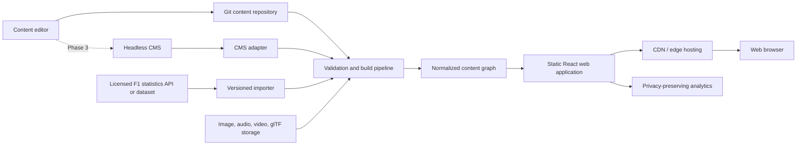
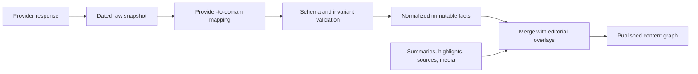

# F1 Track Chronicle - Architecture

## 1. Architecture goals

The architecture must deliver the interaction-rich design while making routine content work inexpensive. In particular, these changes should not require editing page components:

- revise the description of a car;
- add or replace a driver's photograph;
- connect a technology to another season or car;
- change an engine presentation from a still image to a 3D model;
- add a new car, person, technology, or season story using supported presentation blocks.

The system should remain understandable to a small team, validate content before release, serve mostly static pages quickly, and leave room for a headless CMS without coupling the public application to one vendor.

## 2. Recommended solution

Use a **content-driven, statically generated React application** with four explicit layers:

1. **Domain content:** typed entity documents for seasons, cars, people, technologies, teams, races, and sources.
2. **Content blocks and media registry:** composable presentation instructions that reference normalized media assets.
3. **Application features:** routes, queries, navigation state, and reusable entity/page components.
4. **Media renderers:** lazy-loaded implementations for image, gallery, diagram, animation, audio/video, and glTF 3D.

For the initial implementation, keep authored content in the repository as YAML or MDX with JSON Schema validation. Generate a read-only content graph at build time. Later, add a headless CMS as an authoring adapter that exports the same normalized graph. The application consumes the normalized graph, never the CMS SDK directly.

This is the balance point between flexibility and maintainability:

- It is more flexible than hard-coded React data because editors change structured documents and media references.
- It is safer than a generic page builder because only reviewed block types can render.
- It is simpler than launching with a database and custom admin UI because the public site is static and Git supplies review and rollback.
- It avoids CMS lock-in because repository content and a future CMS produce the same versioned contract.

## 3. Decision record

### ADR-001: typed content blocks instead of fixed fields or arbitrary pages

**Decision:** Entity pages have stable structured fields plus an ordered `blocks` array. Each block is a discriminated union registered by type.

**Why:** Fixed fields make an image-to-3D upgrade a schema and UI change. Arbitrary rich HTML or page builders make validation, accessibility, security, and consistent design difficult. Typed blocks allow variation inside known boundaries.

**Consequence:** Adding a brand-new interaction type still requires a developer to implement and test one renderer. Once registered, editors can use it on any compatible entity without further page work.

### ADR-002: media is referenced, not embedded in entity documents

**Decision:** Content blocks refer to a media asset by stable ID. Asset records contain file variants, rights, captions, alt text, poster/fallback, focal point, and technical metadata.

**Why:** A photo can be replaced without touching every entity that uses it. A 3D model can share posters, attribution, and optimization metadata. Rights and accessibility checks become enforceable.

### ADR-003: repository content first, CMS adapter later

**Decision:** Start with Git-managed YAML/MDX and a local asset directory or object storage. Define a `ContentRepository` boundary from day one.

**Why:** The initial collection and team are small, while correctness and versioning matter. Git is low-cost, reviewable, and easy to back up. A CMS becomes worthwhile when non-technical editors, scheduling, or concurrent editing justify its operational cost.

### ADR-004: generated content graph, not runtime joins

**Decision:** Validate and resolve entity relationships at build time into generated JSON indexes and per-route payloads.

**Why:** The public data is read-heavy and changes far less often than it is viewed. Static generation yields fast pages, durable deep links, simple hosting, and no database availability dependency.

### ADR-005: authoritative statistics and editorial narrative stay separate

**Decision:** Imported races, standings, and results live in normalized generated records. Authored summaries, highlights, and relationships live in editorial documents. Build-time selectors combine them.

**Why:** Re-importing historical data must not overwrite human-written stories, translations, media choices, or source notes.

## 4. System context



## 5. Suggested technology stack

The repository does not yet contain a production framework. A conservative starting stack is:

| Concern | Recommendation | Rationale |
| --- | --- | --- |
| Framework | Next.js with TypeScript and static generation | React ecosystem, route-level generation, image/font support, preview/deployment options |
| Styling | CSS Modules plus global design tokens | Close control for the high-fidelity design without runtime styling cost |
| Content | YAML for structured entities; MDX only for long prose that benefits from authoring syntax | Diff-friendly and approachable while keeping structure explicit |
| Schema | Zod as runtime/build schema, with generated JSON Schema for editor tooling | One typed contract with actionable validation errors |
| 3D | React Three Fiber, Drei, Three.js, glTF/GLB | Standard web 3D stack; isolated behind a lazy renderer |
| Images | Build/CDN image transformation to AVIF/WebP with responsive `srcset` | Mobile performance and consistent derivatives |
| Testing | Vitest, Testing Library, Playwright, axe-core | Unit, integration, visual flow, and accessibility coverage |
| Hosting | Static/edge host plus object storage/CDN for heavy media | Low operations burden and cacheable delivery |

Equivalent React-based frameworks are acceptable if the team already operates one. The important architectural contract is the content graph and renderer registry, not the framework brand.

## 6. Repository structure

```text
/
  app/                         # Routes and route layouts
    timeline/
    seasons/[slug]/
    cars/[slug]/
    people/[slug]/
    technologies/[slug]/
    museum/
  src/
    domain/                    # Schemas and domain types; no UI imports
    content/
      repository.ts           # ContentRepository interface
      file-repository.ts       # YAML/MDX implementation
      cms-repository.ts        # Optional future adapter
      queries.ts               # Framework-independent graph queries
      generated/               # Build output, not hand-edited
    features/                  # Timeline, museum, season, subject features
    components/
      blocks/                  # Block registry and renderers
      media/                   # Image, video, audio, model viewers
      ui/                      # Design-system primitives
    styles/                    # Tokens, fonts, global and motion rules
  content/
    seasons/
    cars/
    people/
    technologies/
    teams/
    sources/
    media/
  public/media/                # Small, versioned assets
  tools/content/               # Validate, import, migrate, optimize, check links
  tests/
  docs/
```

Large source photographs, video, audio, and GLB models should use object storage or Git LFS rather than ordinary Git blobs. Their asset manifests remain versioned in `content/media/`.

## 7. Domain model

### 7.1 Common entity envelope

```ts
type LocaleText = {
  zh: string;
  en?: string;
};

type EntityStatus = "draft" | "published" | "archived";

interface EntityBase {
  schemaVersion: 1;
  id: string;                 // Immutable, e.g. "car-mclaren-mp4-4"
  slug: string;               // Mutable with redirect history
  status: EntityStatus;
  title: LocaleText;
  summary: LocaleText;
  aliases?: string[];
  coverMediaId?: string;
  sourceIds: string[];
  blocks: ContentBlock[];
  authoredBy?: string;
  reviewedBy?: string;
  updatedAt: string;
  publishAt?: string;
}
```

IDs are identity and never change. Slugs are presentation; when changed, the build emits a redirect from the old slug. Relationships always use IDs.

### 7.2 Core entities

```ts
interface Season extends EntityBase {
  type: "season";
  year: number;
  eraId: string;
  highlighted: boolean;
  championPersonId: string;
  championCarId: string;
  raceIds: string[];
  standingIds: string[];
  entrantCarIds: string[];
  featuredTechnologyIds: string[];
}

interface Car extends EntityBase {
  type: "car";
  seasonIds: string[];
  constructorId: string;
  driverIds: string[];
  technologyIds: string[];
  engine: string;
  specifications: Record<string, LocalizedValue>;
  wins?: number;
}

interface Person extends EntityBase {
  type: "person";
  personKind: "driver" | "engineer" | "designer" | "principal";
  nationality?: string;
  activeYears?: { from: number; to?: number };
  teamIds: string[];
  representativeSeasonIds: string[];
  championshipYears?: number[];
}

interface Technology extends EntityBase {
  type: "technology";
  category: "engine" | "aerodynamics" | "chassis" | "safety" | "electronics" | "tyres" | "other";
  firstSeasonId?: string;
  seasonIds: string[];
  carIds: string[];
  difficulty: "introductory" | "advanced";
}
```

`Race`, `Standing`, `Team`, `Circuit`, `Era`, `Source`, and `MediaAsset` are separate records. This avoids copying facts into multiple pages and allows reverse links to be generated reliably.

### 7.3 Content block union

```ts
type ContentBlock =
  | RichTextBlock
  | ImageBlock
  | GalleryBlock
  | FactGridBlock
  | QuoteBlock
  | DiagramBlock
  | AnimationBlock
  | AudioBlock
  | VideoBlock
  | Model3DBlock
  | RelatedEntitiesBlock;

interface BlockBase {
  id: string;                 // Stable within the entity
  heading?: LocaleText;
  sourceIds?: string[];
}

interface ImageBlock extends BlockBase {
  type: "image";
  mediaId: string;
  layout?: "full" | "inset" | "portrait";
}

interface Model3DBlock extends BlockBase {
  type: "model3d";
  mediaId: string;
  annotations?: Array<{
    label: LocaleText;
    position: [number, number, number];
  }>;
  initialCamera?: "front" | "three-quarter" | "exploded";
  interaction?: "orbit" | "turntable";
}
```

The page component does not branch on entity names or years. It maps each block to a registered renderer:

```ts
const blockRenderers = {
  richText: RichTextBlockView,
  image: ImageBlockView,
  gallery: GalleryBlockView,
  diagram: DiagramBlockView,
  animation: AnimationBlockView,
  model3d: lazy(() => import("./Model3DBlockView")),
  // ...
} satisfies BlockRendererRegistry;
```

Replacing an engine picture with a model is therefore a content change from `type: image` to `type: model3d` plus a different `mediaId`. The surrounding technology route, story, relationships, analytics, and navigation do not change.

### 7.4 Media asset record

```ts
interface MediaAsset {
  schemaVersion: 1;
  id: string;
  kind: "image" | "audio" | "video" | "model3d" | "poster";
  src: string;
  variants?: Array<{
    src: string;
    mimeType: string;
    width?: number;
    height?: number;
    bytes?: number;
  }>;
  alt: LocaleText;
  caption?: LocaleText;
  credit?: string;
  rights: {
    status: "owned" | "licensed" | "public-domain" | "permission-required";
    license?: string;
    expiresAt?: string;
    sourceUrl?: string;
  };
  posterMediaId?: string;      // Required for video and model3d
  fallbackMediaId?: string;    // Static accessible fallback
  focalPoint?: { x: number; y: number };
  model?: {
    format: "gltf" | "glb";
    draco?: boolean;
    meshopt?: boolean;
    ktx2?: boolean;
    scale?: number;
    cameraTarget?: [number, number, number];
  };
}
```

A media replacement normally keeps the same asset ID when it is a new rendition of the same work. A change in media kind creates a new asset ID and updates only the block reference/type. This preserves auditability and avoids surprising unrelated pages.

## 8. Example content change

Before, a technology uses a still image:

```yaml
id: technology-honda-ra168e
type: technology
title:
  zh: Honda RA168E
  en: Honda RA168E
blocks:
  - id: primary-visual
    type: image
    mediaId: image-ra168e-cutaway
    layout: full
```

After a model is ready, the editor changes only the block and adds the media manifest:

```yaml
blocks:
  - id: primary-visual
    type: model3d
    mediaId: model-ra168e-v1
    initialCamera: exploded
    interaction: orbit
```

```yaml
id: model-ra168e-v1
kind: model3d
src: https://media.example.com/models/ra168e-v1.glb
posterMediaId: image-ra168e-poster
fallbackMediaId: image-ra168e-cutaway
alt:
  zh: Honda RA168E V6 涡轮发动机三维分解模型
  en: Exploded 3D model of the Honda RA168E V6 turbo engine
rights:
  status: owned
model:
  format: glb
  draco: true
  ktx2: true
  scale: 1
  cameraTarget: [0, 0.4, 0]
```

No route, technology detail template, or season component changes.

## 9. Content repository boundary

Application code queries an interface rather than reading files or calling a CMS directly:

```ts
interface ContentRepository {
  getSeasonByYear(year: number, locale: string): Promise<SeasonView>;
  getEntityBySlug(type: EntityType, slug: string, locale: string): Promise<EntityView>;
  listMuseum(type: MuseumType, filters?: MuseumFilters): Promise<EntityCard[]>;
  getTimeline(locale: string): Promise<TimelineEntry[]>;
  search(query: string, locale: string): Promise<SearchResult[]>;
}
```

At build time, the file adapter:

1. parses all source documents;
2. validates individual schemas;
3. validates cross-entity references and media rules;
4. merges imported statistics with editorial overlays;
5. derives reverse relationships and search indexes;
6. emits per-route JSON plus compact timeline and museum indexes.

The future CMS adapter performs steps 1 and 2 differently, but feeds the same normalization pipeline. This keeps vendor concepts out of route components and makes migration testable.

## 10. Rendering architecture

### Server/static responsibilities

- Resolve locale, route, entity, relationships, and metadata.
- Render meaningful headings, summaries, facts, image posters, and links into HTML.
- Emit only the route's content payload, with compact shared indexes cached separately.
- Generate redirects, sitemap, structured data, and social metadata.

### Client responsibilities

- Animate the timeline car and decade selection.
- Manage museum sheet state and return navigation.
- Expand race lists and enhance audio controls.
- Hydrate interactive diagrams, animation, and 3D only when visible or requested.
- Record anonymous product events.

### State boundaries

- **URL state:** current entity, season, locale, museum filters, and shareable selection.
- **Navigation state:** return location and scroll restoration, held in router history/session state.
- **Local component state:** 3D camera rotation, expanded race list, playback state.
- **Content state:** immutable build payload; no client global store is necessary initially.

This avoids a single state object like the prototype's `view`, `carSel`, and `backTo` becoming the production routing model. Real URLs and browser history own navigation.

## 11. 3D and rich-media architecture

The 3D renderer is a capability, not a separate page type.

### Loading sequence

1. Server renders the poster, caption, credit, and text alternative.
2. An intersection observer may prefetch the viewer code near the viewport.
3. The GLB downloads only after explicit interaction or a suitable device/network policy permits eager loading.
4. A progress indicator replaces the poster without changing layout dimensions.
5. On WebGL error, timeout, reduced-data preference, or unsupported device, the poster/fallback remains and the explanation is fully usable.

### Model pipeline

- Source format may vary, but publication output is glTF/GLB.
- Run geometry simplification where acceptable, deduplicate meshes, and compress with Meshopt or Draco.
- Resize and transcode textures to KTX2/Basis; enforce maximum texture dimensions.
- Generate a poster and store bounding box, camera target, scale, triangle count, texture memory estimate, and byte size.
- Validate referenced annotations against model coordinates in preview.
- Serve immutable, content-hashed files from a CDN with long cache lifetime.

### Renderer safety and consistency

- Use registered, application-owned renderers; never execute scripts supplied by content.
- Centralize lighting, background, camera controls, loading UI, and error fallback in `ModelViewer`.
- Let content configure only a small allowlisted set of camera and interaction options.
- Pause rendering when offscreen and cap device pixel ratio to protect battery and thermal performance.
- Honor `prefers-reduced-motion` and a user-visible pause control for continuous animation.

## 12. External statistics ingestion

Historical results may come from a licensed API or dataset. Treat this as a build input with a reproducible importer.



Rules:

- Pin importer and schema versions with each snapshot.
- Store provider IDs separately from internal IDs.
- Never write imported values into authored documents.
- Produce a diff report for changed historical results.
- Keep the last valid snapshot if the provider is unavailable or the new import fails validation.
- Record license and attribution requirements alongside the dataset.

## 13. Validation and publishing workflow

### Local editor workflow

1. Run `content:new <type>` to scaffold a valid document with stable IDs.
2. Edit YAML/MDX and add or reference media.
3. The development server validates on save and shows actionable errors with file paths.
4. Preview routes render drafts only in authenticated/local preview mode.

### Pull request checks

- schema and TypeScript validation;
- unique ID and slug checks;
- relationship and reverse-link integrity;
- date/year invariants;
- source coverage and editorial status;
- alt text, poster, attribution, rights, and expiry checks;
- asset existence, MIME, dimensions, byte size, and 3D budget checks;
- internal link and redirect validation;
- unit, accessibility, route, and selected visual regression tests;
- list of affected routes for focused review.

### Publish

Merge to the publishing branch triggers a static build and atomic deployment. Content and assets use content hashes so rollbacks restore a consistent application/content version. Scheduled content may be handled by a scheduled rebuild or later by CMS webhooks.

## 14. Caching and performance

- Pre-render all published entity routes when the collection is modest; switch to incremental generation only when build time becomes material.
- Cache HTML at the edge with controlled revalidation and immutable hashed assets for one year.
- Generate compact route payloads rather than shipping the entire content graph to every page.
- Ship the timeline summary index once; lazy-load season detail, museum search index, and long lists.
- Code-split by block renderer. The 3D, animation, audio, and video chunks must not enter the home route bundle unless used above the fold.
- Reserve media aspect ratios and use responsive image widths to prevent layout shift.
- Prefetch likely next/previous season data conservatively and respect reduced-data preferences.

## 15. Accessibility architecture

- Schemas require localized `alt` text for meaningful media and allow an explicit `decorative: true` only for genuinely decorative assets.
- `model3d`, animation, audio, and video schemas require a poster/fallback and text explanation or transcript.
- Block renderers expose consistent heading levels and landmark semantics.
- Timeline nodes are real links/buttons with understandable labels; the SVG road and moving car are decorative to assistive technology.
- All pointer interactions have keyboard equivalents.
- Central motion utilities disable nonessential animation under `prefers-reduced-motion`.
- Automated axe checks run on each route family, supplemented by keyboard and screen-reader review.

## 16. Security and content safety

- Parse Markdown/MDX with a strict component allowlist; do not allow arbitrary JSX imports or raw HTML from untrusted authors.
- Sanitize any externally sourced rich text before it enters the content graph.
- Validate URL schemes and media origins; proxy or reject unknown remote embeds.
- Apply Content Security Policy for scripts, styles, images, media, and workers.
- Treat GLB files and image metadata as untrusted input: process them in CI, limit size, and serve them from a cookieless media origin.
- Keep CMS tokens and statistics-provider credentials server-side in build infrastructure.
- Use signed preview URLs and role-based CMS access if the CMS phase is adopted.

## 17. Testing strategy

### Schema and content tests

- Example fixtures for every entity and block type.
- Contract tests run against both file and future CMS adapters.
- Relationship, localization fallback, redirects, and derived reverse-link tests.
- Snapshot tests for importer mappings and explicit review of changed facts.

### Component tests

- Block registry dispatch and unknown-block fallback.
- Media loading, credit, failure, and reduced-motion states.
- Timeline calculations and decade selection.
- Navigation/scroll restoration and museum state.

### End-to-end tests

- Timeline -> 1988 season -> car -> back.
- Museum -> Ayrton Senna -> representative season.
- Technology image and 3D variants render the same surrounding content.
- Keyboard-only traversal and audio stop behavior.
- Offline/failed-model fallback remains informative.

### Visual and performance tests

- Playwright screenshots for the eight design reference views at 390 x 844 and representative desktop widths.
- WebGL canvas pixel/nonblank check plus poster-fallback screenshot.
- Lighthouse or equivalent budgets for home, season, article technology, and 3D technology routes.

## 18. Observability

- Capture route errors, renderer errors, asset failures, and WebGL initialization failures with application/content version and asset ID.
- Measure Core Web Vitals by route family and device class.
- Record rich-media fallback rates without collecting content of user interactions.
- Build pipeline reports validation duration, route count, affected routes, output sizes, and largest assets.
- Alert on publishing failures, expired media rights, and broken production asset URLs.

## 19. CMS adoption criteria

Do not add a CMS merely to make the architecture appear flexible. Add one when two or more of these become persistent problems:

- non-technical editors publish weekly and Git is a barrier;
- multiple editors need concurrent drafts and role-based approval;
- scheduled publishing is routine;
- asset rights and reuse require a searchable digital asset manager;
- localized workflows need per-locale status and review;
- preview administration consumes meaningful engineering time.

When adopted, select a CMS that supports structured schemas, references, custom validation, asset metadata, preview webhooks, localization, and content export. Avoid CMS-specific portable-text objects in UI components; translate them inside `cms-repository.ts`.

## 20. Trade-offs and rejected alternatives

### Hard-coded TypeScript objects in components

Fast for a prototype, but text edits require code changes, relationships drift, and media replacement is coupled to UI logic. Rejected for production content.

### One MDX file per page with arbitrary React components

Flexible for developers but gives editors too much power, weakens validation, risks inconsistent layout, and makes migrations difficult. Limited MDX prose with an allowlisted block schema is acceptable.

### Full headless CMS from day one

Provides a friendly UI but adds vendor modeling, authentication, preview, webhook, migration, and cost concerns before the editorial team proves the need. Deferred behind an adapter.

### Custom database and admin application

Maximum control with the highest maintenance burden. The read-mostly, publish-in-batches workload does not justify it initially.

### A single `mediaType` field on each entity

Simple, but it assumes every page has one fixed hero format and becomes awkward for galleries, comparisons, narration, or multiple technical explainers. Typed blocks plus a media registry provide controlled composition.

## 21. Implementation sequence

1. Establish TypeScript domain schemas, example content, media manifests, and validation CLI.
2. Build the normalized graph and query layer, including reverse links and route payloads.
3. Implement real routes and browser-history navigation for timeline, seasons, museum, and subjects.
4. Reproduce design tokens and mobile layouts using image/article renderers first.
5. Add the block registry, diagram/animation renderers, then the lazy 3D viewer with fallback.
6. Import full historical statistics behind the normalized facts boundary.
7. Add CI preview, visual/accessibility/performance checks, and publishing.
8. Measure editorial friction; introduce a CMS adapter only when adoption criteria are met.

## 22. Definition of architectural success

The architecture is working when:

- normal copy and media updates touch content or asset manifests only;
- content-only changes cannot inject arbitrary application code;
- every published relationship, source, and media requirement is machine-validated;
- an image-to-3D change does not alter routes or page templates;
- the home page does not pay the JavaScript or asset cost of unused 3D content;
- a failed model, API, or new publish cannot make the last valid learning experience unavailable;
- moving from Git-managed content to a CMS changes an adapter and workflow, not the public page components.

